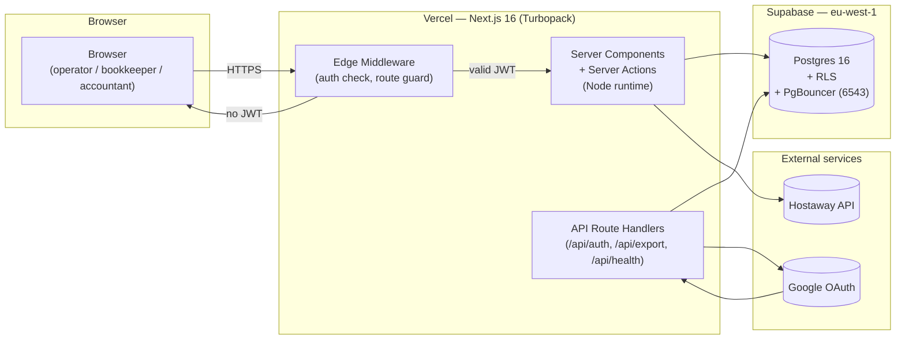
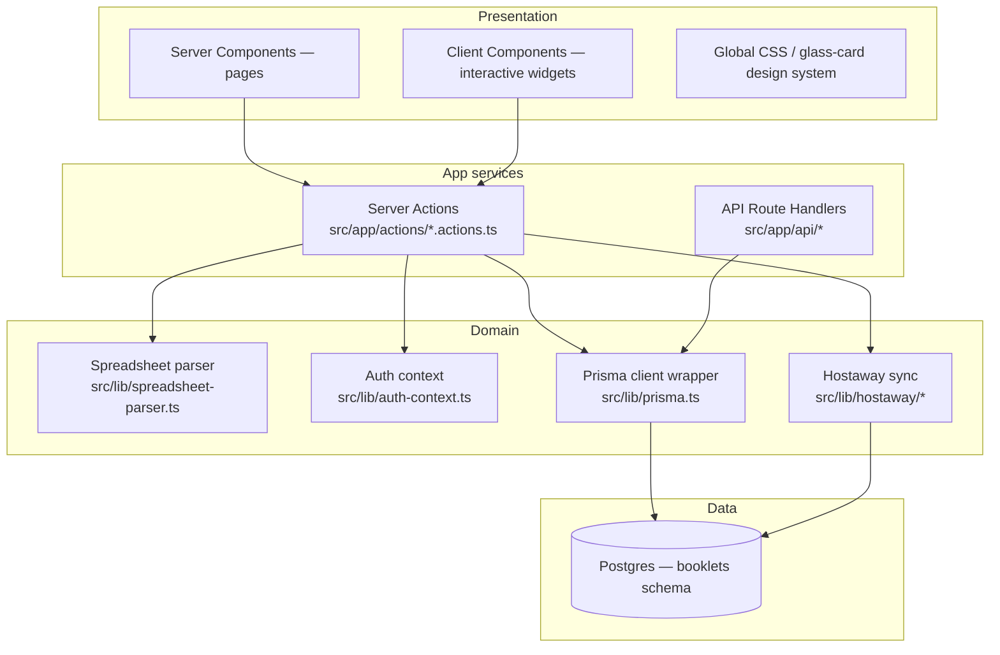
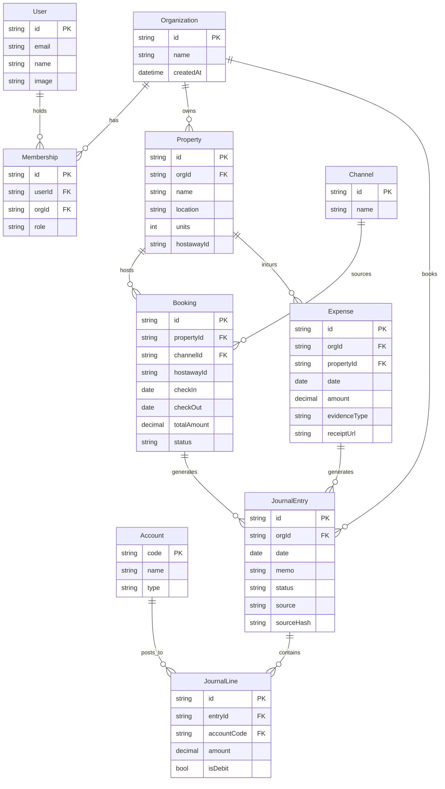
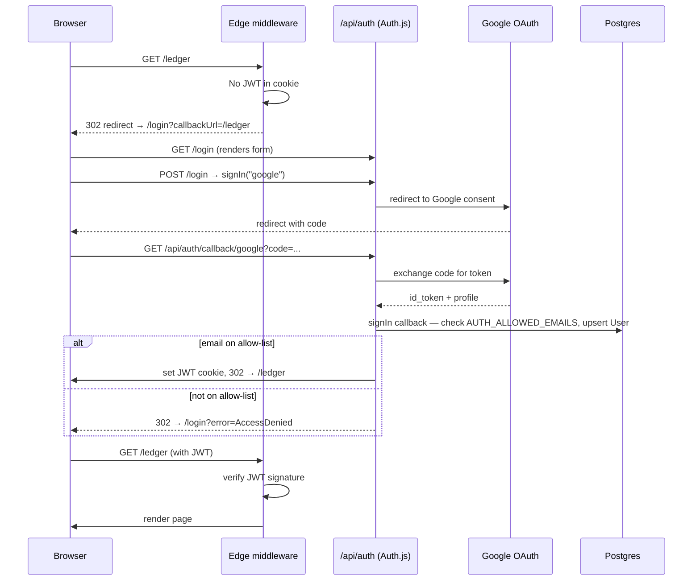
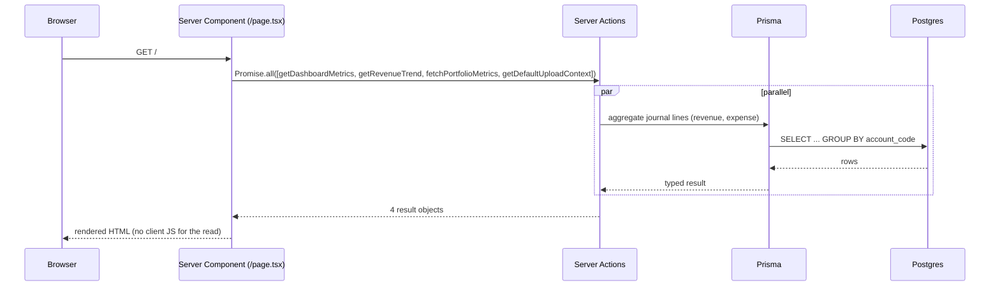
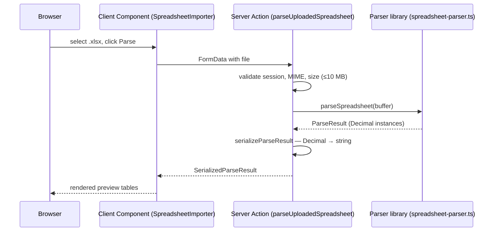
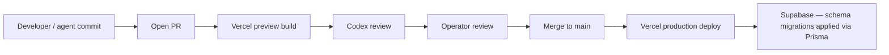

# BookLets — Current-State Architecture

> Snapshot of what's actually deployed today. Companion docs:
> [`02-target-state.md`](02-target-state.md) describes where it's going;
> [`03-review-and-risks.md`](03-review-and-risks.md) audits it.
>
> Companion user-facing docs: [`../HELP.md`](../HELP.md),
> [`../LLM-ASSISTANT.md`](../LLM-ASSISTANT.md).

---

## 1. One-paragraph summary

BookLets is a single-tenant Next.js 16 application running on Vercel,
backed by a Supabase Postgres database in `eu-west-1`. Authentication
is Google OAuth via Auth.js v5 with a JWT session and a hard-coded
email allow-list. Bookings flow in from Hostaway; monthly expense data
flows in from an operator-maintained Excel workbook uploaded through
the browser. The system writes a double-entry general ledger and
exports CSVs for QuickBooks Online.

---

## 2. Deployment topology

**Why this shape:**
- Vercel for zero-ops Next.js hosting, automatic preview environments per
  PR (used by the agent bus to drive review).
- Supabase for managed Postgres + RLS without standing up a separate
  auth service.
- JWT sessions so the edge middleware can verify auth without a database
  round-trip on every request.
- Prisma 7 with the `@prisma/adapter-pg` driver-adapter (mandatory in v7)
  pointed at PgBouncer's transaction-mode pooler on port 6543.

---

## 3. Application layers

**Hard rules in this layout:**
- `auth.config.ts` is **Edge-safe** (no Prisma import). The middleware
  consumes only this file. Importing the Prisma client into the Edge
  runtime crashes every route.
- `auth.ts` is **Node-only** and holds the DB-touching callbacks.
- Server Actions must return **serializable** values — no Prisma model
  classes, no `Decimal` instances. The P1 fix (commit `f1b91eb`) added a
  `SerializedParseResult` shape to enforce this at the boundary.
- All DB access goes through one Prisma client (`@/lib/prisma`).
  Never instantiate `new PrismaClient()` per-request.

---

## 4. Data model

**Why this shape:**
- Multi-tenant **by construction** even though we run single-tenant today.
  Every domain row carries `orgId`. Postgres RLS policies key on `orgId`
  derived from the JWT.
- `JournalEntry.sourceHash` is the idempotency key for the P2 confirm-
  and-post step — re-uploading a spreadsheet row won't create a duplicate
  journal.
- `Expense.evidenceType` and `receiptUrl` are placeholders for P8
  (Google Drive receipts pipeline).
- The chart of accounts is **seeded**, not generated per-tenant. 36 lines
  drafted from the operator's workbook live in `prisma/seed.ts`.

---

## 5. Authentication flow

**Hard rules:**
- `AUTH_ALLOWED_EMAILS` is **fail-closed** in production: unset or empty
  refuses every sign-in by design.
- The JWT is verified at the Edge on every request. There's no session
  table; no DB round-trip on the hot path.
- Account linking is keyed on email — same operator across Google
  accounts becomes one User.

---

## 6. Read path (Dashboard example)

Every authenticated page is a Server Component. Data fetches run in
parallel via `Promise.all`. Nothing about the read path requires
client-side state; client components only show up where you need
interactivity (filters, upload form, sync button).

---

## 7. Write path (Spreadsheet import — P1, current)

No writes happen yet. The preview renders, the operator confirms, the
**P2 phase** then posts journal entries.

---

## 8. External integrations

| Service | Purpose | Auth | Failure mode |
|--------|--------|------|--------------|
| **Google OAuth** | Sign-in only — no Drive / Calendar / Gmail scopes | OAuth 2.0 | Sign-in fails; existing sessions unaffected. |
| **Hostaway** | Bookings + properties feed | API token (server-side) | Sync button reports error; manual booking entry still works. |
| **Supabase Postgres** | System of record | Connection string + RLS policies | App returns 500 until DB recovers. No graceful degradation today. |

---

## 9. Hosting & secrets

| Concern | Choice | Notes |
|--------|--------|-------|
| Hosting | Vercel | One project, preview deploys per PR. |
| Region | eu-west-1 (DB) + Vercel global edge | Operator in Sri Lanka; cold-start latency from APAC is acceptable for ops use. |
| Secrets | Vercel environment variables | Never committed. `.env.example` in repo as the source of truth for shape. |
| Backups | Supabase automated daily | 7-day window on the current plan. |
| Logging | Vercel runtime logs + `console.log` | No structured logging or alerting yet — see `03-review-and-risks.md`. |

---

## 10. Build & deploy pipeline

- Every PR gets a Vercel preview URL (auth-gated).
- Codex auto-reviews and posts comments (see PR #38 for an example).
- Schema migrations land via `prisma migrate deploy` invoked on the
  Vercel build (post-build hook).

---

## 11. What's NOT in the current architecture (deliberate)

- No background job queue. All work is request-scoped.
- No vector store / embeddings. The NotebookLM assistant is external.
- No second region / failover. Single-region by choice.
- No mobile app. Browser-only.
- No service-to-service mesh. Single Next.js app, no microservices.
- No GraphQL. Server Actions + a handful of route handlers cover the API.
- No CSRF tokens — Server Actions are protected by Next.js's built-in
  action ID verification.

Each of these is a deliberate choice for an at-this-scale operation. The
target-state doc covers where some of them might change.
