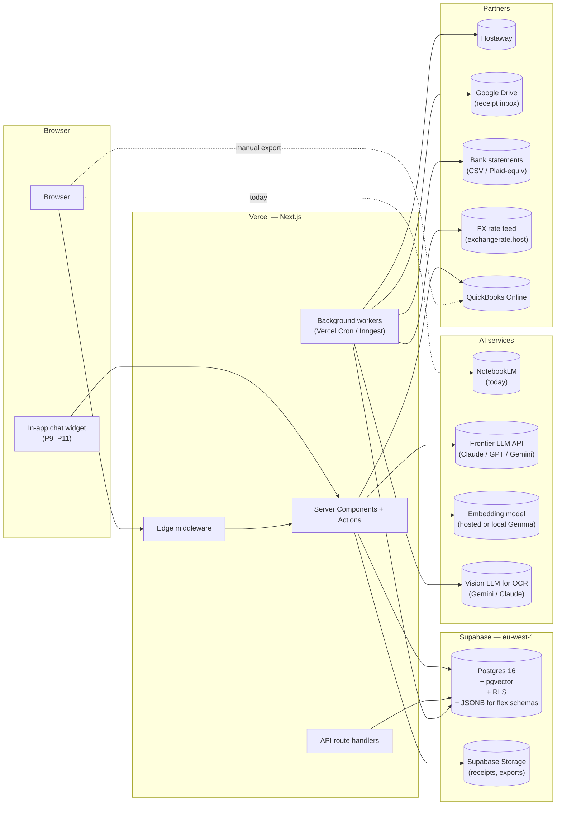
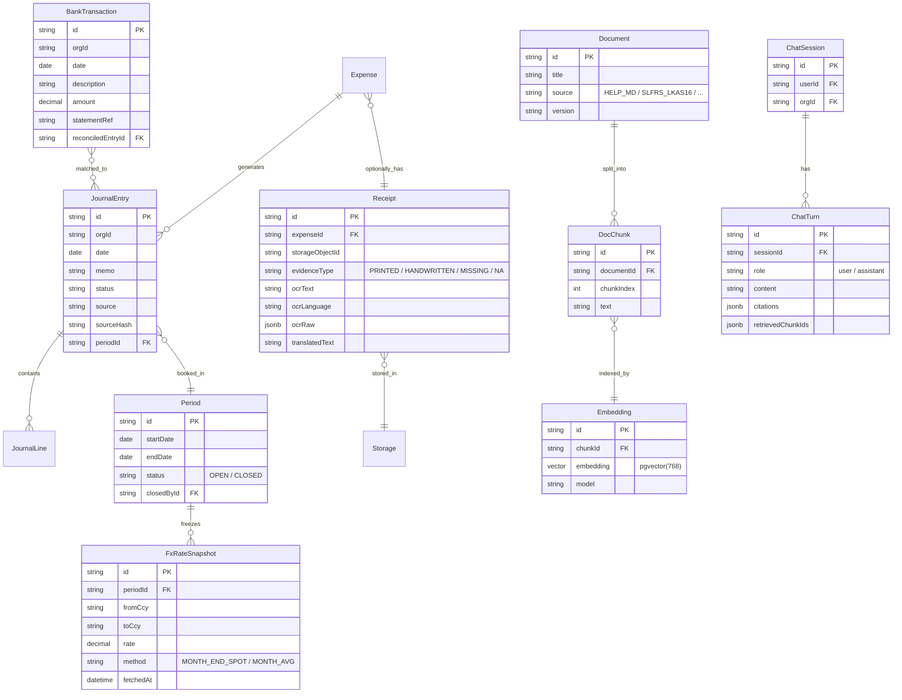
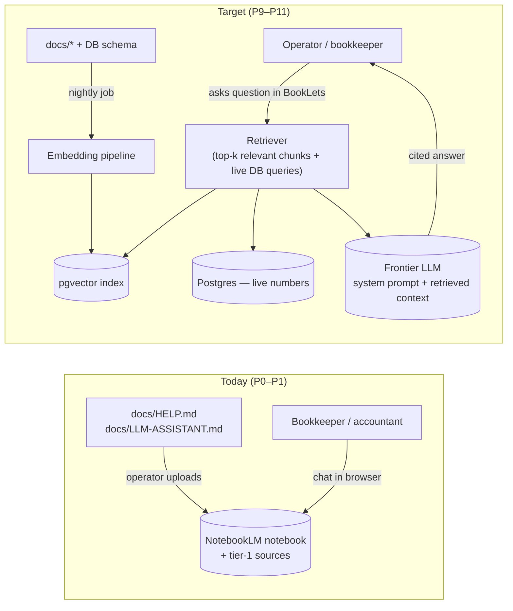
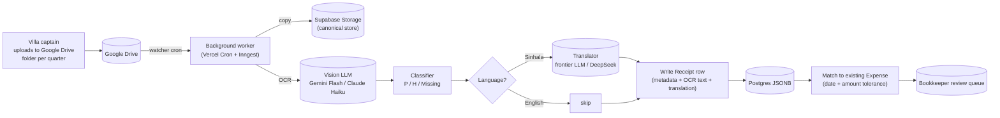
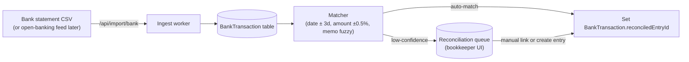
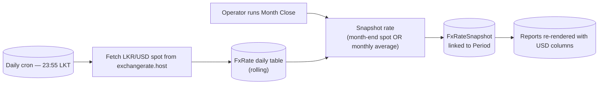
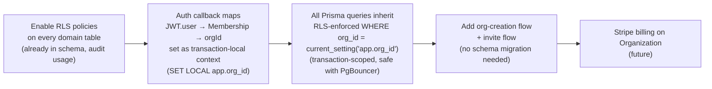

# BookLets — Target-State Architecture

> Where the system is going across phases P2–P11. Read
> [`01-current-state.md`](01-current-state.md) first for the baseline.
> [`03-review-and-risks.md`](03-review-and-risks.md) covers what could
> go wrong on the way there.

This document includes the explicit decisions on **NoSQL** and
**small language models** the operator asked about. See §8 and §9.

---

## 1. Target-state shape

Compared to the current state: **background workers**, **Supabase
Storage**, **pgvector**, **AI services panel**, and a wider set of
**partner integrations** (Drive, bank, FX feed, QBO API).

---

## 2. What ships in each phase

| Phase | Feature | Architecture impact |
|-------|---------|---------------------|
| **P2** | Confirm-and-post on `/imports` | Adds `JournalEntry.sourceHash` idempotency, new server action `postParsedSpreadsheet`. No new infra. |
| **P3** | Editable grid before posting | New client component with optimistic updates. No new infra. |
| **P4** | Bank reconciliation | New `BankTransaction` table; CSV import endpoint; matching algorithm in a server action. New background job to ingest scheduled bank exports. |
| **P5** | Month-close + accountant pack | New `Period` table, FX-rate snapshot stored on close, exporter generates trial balance + P&L + balance sheet PDFs into Supabase Storage. |
| **P6** | STR dashboards (channel mix, seasonality) | New aggregated views (Postgres materialised views, refreshed nightly by background worker). |
| **P7** | Capex tracker + forecast editor | New tables: `CapexItem`, `Forecast`. No new infra. |
| **P8** | Receipts pipeline (Drive → OCR → P/H flag → Sinhala translation) | Adds **Supabase Storage**, **vision LLM API**, **background worker**, **Google Drive watcher**. Receipts metadata in Postgres JSONB. |
| **P9–P11** | In-app AI chat — DB-grounded, SLFRS-sourced | Adds **pgvector**, **embedding pipeline**, **RAG retrieval**, **chat history table**. NotebookLM retires here. |

---

## 3. Data-model evolution

New tables, no destructive changes to existing ones. Migrations are
additive in every phase.

---

## 4. The AI assistant — NotebookLM bridge → in-app chat

**Grounding rules carry forward unchanged from
[`../LLM-ASSISTANT.md`](../LLM-ASSISTANT.md):**
- Answer only from sources (docs) and live DB rows.
- Cite the source or query of every fact.
- Refuse questions outside scope.
- For accounting methodology, defer to SLFRS.

**The transition:** NotebookLM is the "good enough" assistant *until*
P9–P11 ships. The same source set used in NotebookLM becomes the
embedded source set inside BookLets. Operators don't lose continuity —
the in-app chat is a strict superset because it adds live database
access.

---

## 5. Receipt pipeline (P8) in detail

Receipts that can't be auto-matched land in a review queue surfaced in
the in-app dashboard. The classifier "P/H" output is stored on
`Receipt.evidenceType`.

---

## 6. Bank reconciliation (P4)

Source-of-truth stays inside BookLets. The bank feed is a read-only
view; nothing about the ledger changes except gaining a foreign-key
pointer from the journal entry to its bank line.

---

## 7. FX-rate handling (supports P5 month-close)

The chosen method (`MONTH_END_SPOT` vs `MONTH_AVG`) is stored on the
snapshot row so historical reports remain reproducible even if the
policy changes later.

---

## 8. Decision: NoSQL (MongoDB) — **NO**

| Question | Answer |
|---------|--------|
| Where would Mongo go? | Receipt OCR payloads, audit logs, parsed spreadsheet snapshots, chat history. |
| What does Postgres do instead? | **JSONB columns** on `Receipt.ocrRaw`, `JournalEntry.metadata`, `ChatTurn.citations`. Full GIN indexes on JSONB keep query performance acceptable. |
| What does Mongo cost us? | Two backup pipelines. Two query languages. Loss of transactional consistency between ledger rows and their metadata. Cross-store joins move into application code. |
| When would we revisit? | If receipt document scale crosses ~10⁷ rows (Ko Lake won't), or if the team builds a separate product that's truly document-first. |

**Verdict:** Postgres + JSONB covers every legitimate "we need flexible
schema" case. Add Mongo only if we discover a real workload Postgres
can't handle — and even then, prefer a managed Postgres extension
(e.g. pgvector, partitioning) before adding a second store.

---

## 9. Decision: Small language model (Gemma) — **NOT YET**

| Question | Answer |
|---------|--------|
| Where could Gemma fit? | (a) Local **embedding generation** for RAG retrieval, (b) routing/classification (P/H flag, "is this a question I should escalate?"), (c) cheap Sinhala translation, (d) offline-capable receipt OCR post-processing. |
| Why not now? | At Ko Lake's volume, frontier APIs (Gemini Flash, Claude Haiku, GPT-4o-mini) cost less than hosting a GPU for self-hosted Gemma. Quality on Sinhala translation is materially better with frontier models. The operational cost of running a model server (deployment, version pinning, GPU node) outweighs the API spend until usage scales. |
| When would we revisit? | Monthly LLM spend > ~$100–200; or a strict data-residency requirement that forbids data leaving the operator's infrastructure. |
| First place an SLM lands if we adopt one | **Embedding model**, not chat model. Embeddings are the cheapest-per-query frontier-API cost and the easiest to self-host with no quality regression. `EMB` in the target-state diagram is deliberately ambiguous so we can swap a hosted embedding API for a local Gemma model later. |

**Verdict:** Use frontier LLM APIs for OCR, translation, and chat. Use
hosted embeddings for retrieval. Architect so the embedding provider is
replaceable. Revisit self-hosting Gemma when usage justifies it.

---

## 10. Multi-tenancy promotion path

We're single-tenant today but the schema already carries `orgId`
everywhere. Promoting to multi-tenant is:

No data migration needed — only policies, transaction-local context, and
UI for org switching. Use `SET LOCAL app.org_id = '…'` inside each
transaction (not `SET` / session GUC) — PgBouncer runs in transaction mode
and session state is not preserved across pooled connections.

---

## 11. Observability — what we add as we grow

| Stage | Tool | Why |
|------|------|-----|
| P2 | Structured logging via `pino` to Vercel logs | Replace `console.log`, get JSON parsing for free. |
| P4 | Sentry (or equivalent) for client + server errors | Bank reconciliation surfaces exceptions; bookkeeper needs to see them. |
| P5 | Vercel Analytics for page load metrics | Once external accountants use the system regularly. |
| P9 | OpenLLMetry / langfuse for LLM call traces | Required as soon as the in-app chat is live — debugging without traces is painful. |

---

## 12. What the architecture does NOT become

- **Not microservices.** Single Next.js app stays. The only service split
  we'd accept is a separate **background worker process** for jobs that
  shouldn't run in serverless functions (long OCR batches).
- **Not multi-cloud.** Vercel + Supabase is the platform. Migration cost
  is high and the lock-in is acceptable for the operating scale.
- **Not real-time / websockets.** No live collaboration requirement.
  Polling for sync status is fine.
- **Not its own auth system.** Auth.js + Google + allow-list is enough.
  If we ever need SAML, we lean on Auth.js providers, not a custom
  implementation.
